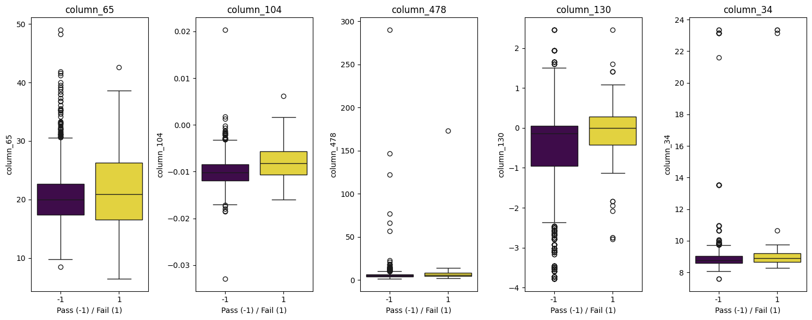

# Semiconductor Manufacturing Yield Analysis w/ Random Forests

## Data Description
Source:
https://archive.ics.uci.edu/dataset/179/secom

* Data comes from semiconductor manufacturing. 
* ~ 600 **unlabeled** features, including pass/fail yield.
* ~ 1600 rows, indexed by a timestamp. Each timestamp corresponds to a "production unit" per documentation.

**Goals and Strategy**

In this analysis we will train progressively improved random forest models to identify top yield predictors. 

## Data Preparation


```python
import pandas as pd
import polars as pl

# Read in the data
# Define schema to treat all 591 columns as Float64. 
# This is necessary because polars will infer i64 on some columns, 
# probably because the first values encountered are integers 
schema = {f"column_{i}": pl.Float64 for i in range(591)}

data = pl.read_csv(
    source = r'data/secom.data', 
    has_header = False,
    separator = ' ',
    null_values = 'NaN',
    schema_overrides = schema)
#data.tail()

# Read the indeces
indeces = pl.read_csv(
    source = r'data/secom_labels.data',
    separator = ' ',
    has_header = False,
    new_columns = ['pass_fail','timestamp'],
    try_parse_dates=True
).select(['timestamp','pass_fail'])
# Select here just reorders the columns for display aesthetics
# indeces.tail()

# Will use hstack to stitch the files together as relation is implicit. Normally would join on explicit shared column. 
df = indeces.hstack(data)
df.tail()
```


<div><style>
.dataframe > thead > tr,
.dataframe > tbody > tr {
  text-align: right;
  white-space: pre-wrap;
}
</style>
<small>shape: (5, 592)</small><table border="1" class="dataframe"><thead><tr><th>timestamp</th><th>pass_fail</th><th>column_1</th><th>column_2</th><th>column_3</th><th>column_4</th><th>column_5</th><th>column_6</th><th>column_7</th><th>column_8</th><th>column_9</th><th>column_10</th><th>column_11</th><th>column_12</th><th>column_13</th><th>column_14</th><th>column_15</th><th>column_16</th><th>column_17</th><th>column_18</th><th>column_19</th><th>column_20</th><th>column_21</th><th>column_22</th><th>column_23</th><th>column_24</th><th>column_25</th><th>column_26</th><th>column_27</th><th>column_28</th><th>column_29</th><th>column_30</th><th>column_31</th><th>column_32</th><th>column_33</th><th>column_34</th><th>column_35</th><th>&hellip;</th><th>column_554</th><th>column_555</th><th>column_556</th><th>column_557</th><th>column_558</th><th>column_559</th><th>column_560</th><th>column_561</th><th>column_562</th><th>column_563</th><th>column_564</th><th>column_565</th><th>column_566</th><th>column_567</th><th>column_568</th><th>column_569</th><th>column_570</th><th>column_571</th><th>column_572</th><th>column_573</th><th>column_574</th><th>column_575</th><th>column_576</th><th>column_577</th><th>column_578</th><th>column_579</th><th>column_580</th><th>column_581</th><th>column_582</th><th>column_583</th><th>column_584</th><th>column_585</th><th>column_586</th><th>column_587</th><th>column_588</th><th>column_589</th><th>column_590</th></tr><tr><td>datetime[μs]</td><td>i64</td><td>f64</td><td>f64</td><td>f64</td><td>f64</td><td>f64</td><td>f64</td><td>f64</td><td>f64</td><td>f64</td><td>f64</td><td>f64</td><td>f64</td><td>f64</td><td>f64</td><td>f64</td><td>f64</td><td>f64</td><td>f64</td><td>f64</td><td>f64</td><td>f64</td><td>f64</td><td>f64</td><td>f64</td><td>f64</td><td>f64</td><td>f64</td><td>f64</td><td>f64</td><td>f64</td><td>f64</td><td>f64</td><td>f64</td><td>f64</td><td>f64</td><td>&hellip;</td><td>f64</td><td>f64</td><td>f64</td><td>f64</td><td>f64</td><td>f64</td><td>f64</td><td>f64</td><td>f64</td><td>f64</td><td>f64</td><td>f64</td><td>f64</td><td>f64</td><td>f64</td><td>f64</td><td>f64</td><td>f64</td><td>f64</td><td>f64</td><td>f64</td><td>f64</td><td>f64</td><td>f64</td><td>f64</td><td>f64</td><td>f64</td><td>f64</td><td>f64</td><td>f64</td><td>f64</td><td>f64</td><td>f64</td><td>f64</td><td>f64</td><td>f64</td><td>f64</td></tr></thead><tbody><tr><td>2008-10-16 15:13:00</td><td>-1</td><td>2899.41</td><td>2464.36</td><td>2179.7333</td><td>3085.3781</td><td>1.4843</td><td>100.0</td><td>82.2467</td><td>0.1248</td><td>1.3424</td><td>-0.0045</td><td>-0.0057</td><td>0.9579</td><td>203.9867</td><td>0.0</td><td>11.7692</td><td>419.3404</td><td>10.2397</td><td>0.9693</td><td>193.747</td><td>12.5373</td><td>1.4072</td><td>-5418.75</td><td>2608.0</td><td>-6228.25</td><td>356.0</td><td>1.2817</td><td>1.954</td><td>7.0793</td><td>71.1444</td><td>2.2222</td><td>0.1753</td><td>3.468</td><td>83.8405</td><td>8.7164</td><td>50.2482</td><td>&hellip;</td><td>8.5138</td><td>0.3141</td><td>85.1806</td><td>4.2063</td><td>1.0367</td><td>1.0972</td><td>0.3553</td><td>0.0929</td><td>32.3812</td><td>264.272</td><td>0.5671</td><td>4.98</td><td>0.0877</td><td>2.0902</td><td>0.0382</td><td>1.8844</td><td>15.4662</td><td>536.3418</td><td>2.0153</td><td>7.98</td><td>0.2363</td><td>2.6401</td><td>0.0785</td><td>1.4879</td><td>11.7256</td><td>0.0068</td><td>0.0138</td><td>0.0047</td><td>203.172</td><td>0.4988</td><td>0.0143</td><td>0.0039</td><td>2.8669</td><td>0.0068</td><td>0.0138</td><td>0.0047</td><td>203.172</td></tr><tr><td>2008-10-16 20:49:00</td><td>-1</td><td>3052.31</td><td>2522.55</td><td>2198.5667</td><td>1124.6595</td><td>0.8763</td><td>100.0</td><td>98.4689</td><td>0.1205</td><td>1.4333</td><td>-0.0061</td><td>-0.0093</td><td>0.9618</td><td>204.0173</td><td>0.0</td><td>9.162</td><td>405.8178</td><td>10.2285</td><td>0.9696</td><td>193.7889</td><td>12.402</td><td>1.3949</td><td>-6408.75</td><td>2277.5</td><td>-3675.5</td><td>339.0</td><td>1.087</td><td>1.8023</td><td>5.1515</td><td>72.8444</td><td>2.0</td><td>0.1416</td><td>4.7088</td><td>84.0623</td><td>8.9607</td><td>50.2067</td><td>&hellip;</td><td>6.7381</td><td>0.5058</td><td>27.0176</td><td>3.6251</td><td>1.8156</td><td>0.9671</td><td>0.3105</td><td>0.0696</td><td>32.1048</td><td>266.832</td><td>0.6254</td><td>4.56</td><td>0.1308</td><td>1.742</td><td>0.0495</td><td>1.7089</td><td>20.9118</td><td>537.9264</td><td>2.1814</td><td>5.48</td><td>0.3891</td><td>1.9077</td><td>0.1213</td><td>1.0187</td><td>17.8379</td><td>null</td><td>null</td><td>null</td><td>null</td><td>0.4975</td><td>0.0131</td><td>0.0036</td><td>2.6238</td><td>0.0068</td><td>0.0138</td><td>0.0047</td><td>203.172</td></tr><tr><td>2008-10-17 05:26:00</td><td>-1</td><td>2978.81</td><td>2379.78</td><td>2206.3</td><td>1110.4967</td><td>0.8236</td><td>100.0</td><td>99.4122</td><td>0.1208</td><td>null</td><td>null</td><td>null</td><td>null</td><td>null</td><td>null</td><td>null</td><td>null</td><td>null</td><td>null</td><td>null</td><td>12.4555</td><td>1.4256</td><td>-5153.25</td><td>2707.0</td><td>-4102.0</td><td>-1226.0</td><td>1.293</td><td>1.9435</td><td>7.2315</td><td>71.2667</td><td>2.2333</td><td>0.1659</td><td>3.4912</td><td>85.8638</td><td>8.1728</td><td>50.9333</td><td>&hellip;</td><td>7.0023</td><td>0.5605</td><td>74.1541</td><td>4.1095</td><td>2.0228</td><td>0.9718</td><td>0.1266</td><td>0.0332</td><td>13.0316</td><td>256.73</td><td>0.8209</td><td>11.09</td><td>0.2388</td><td>4.4128</td><td>0.0965</td><td>4.3197</td><td>29.0954</td><td>530.3709</td><td>2.3435</td><td>6.49</td><td>0.4154</td><td>2.176</td><td>0.1352</td><td>1.2237</td><td>17.7267</td><td>0.0197</td><td>0.0086</td><td>0.0025</td><td>43.5231</td><td>0.4987</td><td>0.0153</td><td>0.0041</td><td>3.059</td><td>0.0197</td><td>0.0086</td><td>0.0025</td><td>43.5231</td></tr><tr><td>2008-10-17 06:01:00</td><td>-1</td><td>2894.92</td><td>2532.01</td><td>2177.0333</td><td>1183.7287</td><td>1.5726</td><td>100.0</td><td>98.7978</td><td>0.1213</td><td>1.4622</td><td>-0.0072</td><td>0.0032</td><td>0.9694</td><td>197.2448</td><td>0.0</td><td>9.7354</td><td>401.9153</td><td>9.863</td><td>0.974</td><td>187.3818</td><td>12.3937</td><td>1.3868</td><td>-5271.75</td><td>2676.5</td><td>-4001.5</td><td>394.75</td><td>1.2875</td><td>1.988</td><td>7.3255</td><td>70.5111</td><td>2.9667</td><td>0.2386</td><td>3.2803</td><td>84.5602</td><td>9.193</td><td>50.6547</td><td>&hellip;</td><td>6.7381</td><td>0.5058</td><td>27.0176</td><td>3.6251</td><td>1.8156</td><td>1.0108</td><td>0.192</td><td>0.0435</td><td>18.9966</td><td>264.272</td><td>0.5671</td><td>4.98</td><td>0.0877</td><td>2.0902</td><td>0.0382</td><td>1.8844</td><td>15.4662</td><td>534.3936</td><td>1.9098</td><td>9.13</td><td>0.3669</td><td>3.2524</td><td>0.104</td><td>1.7085</td><td>19.2104</td><td>0.0262</td><td>0.0245</td><td>0.0075</td><td>93.4941</td><td>0.5004</td><td>0.0178</td><td>0.0038</td><td>3.5662</td><td>0.0262</td><td>0.0245</td><td>0.0075</td><td>93.4941</td></tr><tr><td>2008-10-17 06:07:00</td><td>-1</td><td>2944.92</td><td>2450.76</td><td>2195.4444</td><td>2914.1792</td><td>1.5978</td><td>100.0</td><td>85.1011</td><td>0.1235</td><td>null</td><td>null</td><td>null</td><td>null</td><td>null</td><td>null</td><td>null</td><td>null</td><td>null</td><td>null</td><td>null</td><td>12.479</td><td>1.4048</td><td>-5319.5</td><td>2668.0</td><td>-3951.75</td><td>-425.0</td><td>1.302</td><td>2.0085</td><td>7.3395</td><td>73.0667</td><td>2.5889</td><td>0.2021</td><td>3.386</td><td>83.3424</td><td>8.7786</td><td>50.194</td><td>&hellip;</td><td>6.7381</td><td>0.5058</td><td>27.0176</td><td>3.6251</td><td>1.8156</td><td>1.0827</td><td>0.2327</td><td>0.0678</td><td>21.4914</td><td>257.974</td><td>0.6193</td><td>8.42</td><td>0.1307</td><td>3.0894</td><td>0.0493</td><td>3.2639</td><td>21.1128</td><td>528.7918</td><td>2.0831</td><td>6.81</td><td>0.4774</td><td>2.2727</td><td>0.1495</td><td>1.2878</td><td>22.9183</td><td>0.0117</td><td>0.0162</td><td>0.0045</td><td>137.7844</td><td>0.4987</td><td>0.0181</td><td>0.004</td><td>3.6275</td><td>0.0117</td><td>0.0162</td><td>0.0045</td><td>137.7844</td></tr></tbody></table></div>


```python
# As sanity check let's count the failure rate
fails = indeces.select('pass_fail').filter( pl.col.pass_fail == 1 ).height

fail_rate = 100*fails/indeces.height
print(f"The failure rate is {round(fail_rate)}%")
```

    The failure rate is 7%
    

## Data Analysis
### Random Forest, first try


```python
from sklearn.ensemble import RandomForestClassifier
from sklearn.model_selection import train_test_split
import numpy as np

X = data.to_numpy()
y = df['pass_fail'].to_numpy()

# Get feature names for importances
feature_names = df.drop(["pass_fail", "timestamp"]).columns

X_train, X_test, y_train, y_test = train_test_split(X, y, test_size=0.2, random_state=42, stratify=y)

model = RandomForestClassifier(n_estimators=100, random_state=42)
f = model.fit(X_train, y_train)
```

After succesfully fitting the model we can extract the most important features.


```python
import pandas as pd
importances = pd.Series(model.feature_importances_, index=feature_names)
print('Top predictors')
print('-'*60)
print(importances.sort_values(ascending=False).head(10))
```

    Top predictors
    ------------------------------------------------------------
    column_563    0.013259
    column_66     0.012310
    column_65     0.012131
    column_575    0.009252
    column_268    0.008815
    column_427    0.008118
    column_442    0.007570
    column_39     0.007448
    column_27     0.006392
    column_60     0.006293
    dtype: float64
    

As sanity check let us check the distribution of test sets to ensure a proper proportion of failures are present.


```python
# Class distribution
# Let's double check that the test and train sets are properly stratified.
print(pd.Series(y_train).value_counts(normalize=True))
print(pd.Series(y_test).value_counts(normalize=True))
```

    -1    0.933759
     1    0.066241
    Name: proportion, dtype: float64
    -1    0.933121
     1    0.066879
    Name: proportion, dtype: float64
    

Now let's evaluate the model. 


```python
from sklearn.metrics import classification_report

y_pred = model.predict(X_test)
print( classification_report(y_test, y_pred) )
```

                  precision    recall  f1-score   support
    
              -1       0.93      1.00      0.97       293
               1       0.00      0.00      0.00        21
    
        accuracy                           0.93       314
       macro avg       0.47      0.50      0.48       314
    weighted avg       0.87      0.93      0.90       314
    
    

    C:\prog\WPy64-31241\python-3.12.4.amd64\Lib\site-packages\sklearn\metrics\_classification.py:1565: UndefinedMetricWarning: Precision is ill-defined and being set to 0.0 in labels with no predicted samples. Use `zero_division` parameter to control this behavior.
      _warn_prf(average, modifier, f"{metric.capitalize()} is", len(result))
    C:\prog\WPy64-31241\python-3.12.4.amd64\Lib\site-packages\sklearn\metrics\_classification.py:1565: UndefinedMetricWarning: Precision is ill-defined and being set to 0.0 in labels with no predicted samples. Use `zero_division` parameter to control this behavior.
      _warn_prf(average, modifier, f"{metric.capitalize()} is", len(result))
    C:\prog\WPy64-31241\python-3.12.4.amd64\Lib\site-packages\sklearn\metrics\_classification.py:1565: UndefinedMetricWarning: Precision is ill-defined and being set to 0.0 in labels with no predicted samples. Use `zero_division` parameter to control this behavior.
      _warn_prf(average, modifier, f"{metric.capitalize()} is", len(result))
    

This model is very bad. 
* Precision (  True positive / (False positive + True positive) ) is **zero** for yield failures.
* Recall (  True positive / (False negative + True positive) is zero as well.

This means the features listed above may not be very important. Performance may improve by balancing the model training across pass/fail, to be explored next.

### Random Forest with "balanced" training
Here we'll use a version of the random forest algorithm that balances the fraction of failures in the training data fed to every tree in the ensemble 50/50.


```python
from sklearn.impute import SimpleImputer
from imblearn.ensemble import BalancedRandomForestClassifier

# Impute missing values -- in contrast to non-balanced function, this function cannot handle NaNs. 
# Hence we will impute with median. 
imputer = SimpleImputer(strategy="median")
X_train_imputed = imputer.fit_transform(X_train)
X_test_imputed = imputer.transform(X_test)

# Train model
model = BalancedRandomForestClassifier(n_estimators=100, random_state=42)
model.fit(X_train_imputed, y_train)

# Predict with default threshold (0.5)
y_pred = model.predict(X_test_imputed)

# Classification report
print("\nClassification Report")
print(classification_report(y_test, y_pred, labels=[-1, 1], target_names=["Pass", "Fail"], zero_division=0))

# Feature importances
# This will now work because len(model.feature_importances_) == len(feature_names)
importances = pd.Series(model.feature_importances_, index=feature_names)
print("\nTop 10 Feature Importances:")
print(importances.sort_values(ascending=False).head(10))
```

    
    Classification Report
                  precision    recall  f1-score   support
    
            Pass       0.95      0.91      0.93       293
            Fail       0.18      0.29      0.22        21
    
        accuracy                           0.87       314
       macro avg       0.56      0.60      0.57       314
    weighted avg       0.90      0.87      0.88       314
    
    
    Top 10 Feature Importances:
    column_104    0.013821
    column_34     0.011932
    column_65     0.011552
    column_130    0.009553
    column_478    0.008211
    column_342    0.007600
    column_60     0.007068
    column_82     0.006649
    column_206    0.006486
    column_181    0.006441
    dtype: float64
    

This is a marked improvement in that the model now correctly predicts 18% of failures, up from zero. Let's explore if hyperparameter tuning can further improve the model.

### Hyperparameter tuning on Balanced Forest


```python
from sklearn.model_selection import GridSearchCV
from sklearn.metrics import make_scorer, f1_score

# Define parameter grid
param_grid = {
    'n_estimators': [100, 200],
    'max_depth': [10, 20, None],
    'min_samples_split': [2, 5],
    'min_samples_leaf': [1, 2],
    'max_features': ['sqrt', 'log2']
}

# Initialize model
model = BalancedRandomForestClassifier(random_state=42)

# Custom scorer for Fail class F1-score
f1_scorer = make_scorer(f1_score, pos_label=1)

# Grid search
grid_search = GridSearchCV(
    model, param_grid, cv=5, scoring=f1_scorer, n_jobs=-1, verbose=1
)
grid_search.fit(X_train_imputed, y_train)

# Best parameters and score
print("\nBest Parameters:", grid_search.best_params_)
print("Best F1-Score for Fail (CV):", grid_search.best_score_)

# Train final model with best parameters
best_model = grid_search.best_estimator_
y_pred = best_model.predict(X_test_imputed)

# Classification report
print("\nClassification Report:")
print(classification_report(y_test, y_pred, labels=[-1, 1], target_names=["Pass", "Fail"], zero_division=0))

# Feature importances
importances = pd.Series(best_model.feature_importances_, index=feature_names)
print("\nTop 10 Feature Importances:")
print(importances.sort_values(ascending=False).head(10))
```

    Fitting 5 folds for each of 48 candidates, totalling 240 fits
    
    Best Parameters: {'max_depth': 10, 'max_features': 'sqrt', 'min_samples_leaf': 1, 'min_samples_split': 5, 'n_estimators': 100}
    Best F1-Score for Fail (CV): 0.2563347763347763
    
    Classification Report:
                  precision    recall  f1-score   support
    
            Pass       0.94      0.92      0.93       293
            Fail       0.18      0.24      0.20        21
    
        accuracy                           0.88       314
       macro avg       0.56      0.58      0.57       314
    weighted avg       0.89      0.88      0.88       314
    
    
    Top 10 Feature Importances:
    column_65     0.012765
    column_104    0.012229
    column_478    0.009555
    column_130    0.009415
    column_34     0.008118
    column_342    0.008072
    column_60     0.007876
    column_574    0.007838
    column_131    0.007682
    column_248    0.006736
    dtype: float64
    

Hyperparameter tuning did not produce a substantially improved model relative to balanced forest. Let's visualize the top predictors.

## Results and Visualization


```python
import seaborn as sns
import matplotlib.pyplot as plt

df_pandas = df.to_pandas()
top_features_rf = pd.Series(best_model.feature_importances_, index=feature_names).sort_values(ascending=False).head(5).index

plt.figure(figsize=(15, 6))
for i, feature in enumerate(top_features_rf, 1):
    plt.subplot(1, 5, i)
    
    # Apply the corrected arguments to sns.boxplot
    sns.boxplot(
        data=df_pandas, 
        x='pass_fail', 
        y=feature, 
        hue='pass_fail',      # Assign the grouping variable to hue
        palette='viridis',    # Palette now correctly applies to the hue
        legend=False          # Disable the redundant legend
    )
    
    plt.title(f'{feature}')
    plt.xlabel('Pass (-1) / Fail (1)')

plt.tight_layout()
plt.show()
```


    

    

